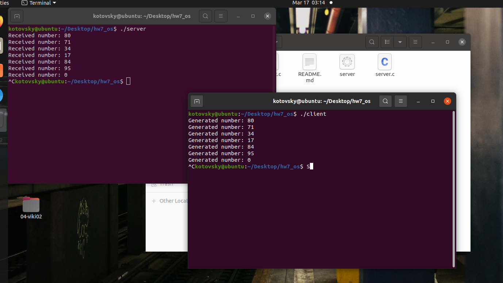

## Домашнее задание №7.
### Выполнил Котовский Семён Олегович, БПИ-219.

#### Инструкция по компиляции:

    Скомпилируйте код сервера и клиента:

Откройте терминал и перейдите в каталог, где находятся файлы с кодом. Затем скомпилируйте файлы server.c и client.c с помощью компилятора gcc:

```
gcc -o server server.c -lrt
gcc -o client client.c -lrt
```

Это создаст два исполняемых файла: server и client.
Запустите сервер:
```
./server
```


Сервер будет ожидать получения чисел от клиента. Оставьте терминал открытым.
Запустите клиент:

Откройте новое окно терминала и перейдите в каталог, где находятся исполняемые файлы. Запустите клиентскую программу:

```
./client
```
Клиент будет генерировать случайные числа и отправлять их серверу через разделяемую память. В окне терминала клиента будут отображаться сгенерированные числа, а в окне терминала сервера - полученные числа.

Завершение работы программ:

Чтобы корректно завершить работу программ, нажмите Ctrl+C в окне терминала клиента и затем в окне терминала сервера. Это активирует обработчики сигналов SIGINT, которые освободят разделяемую память и закроют файлы-дескрипторы.

#### Описание программ:

В этих программах реализована клиент-серверная архитектура с использованием разделяемой памяти в качестве механизма коммуникации между клиентом и сервером. Разделяемая память предоставляет общую область памяти, к которой могут обращаться обе программы. В данном случае, клиент генерирует случайные числа и помещает их в разделяемую память, а сервер читает эти числа и выводит их на экран.

Логика работы сервера:

1. Устанавливает обработчик сигналов для корректного завершения при получении сигнала SIGINT (например, при нажатии Ctrl+C).
2. Создает и открывает объект разделяемой памяти с помощью shm_open.
3. Устанавливает размер разделяемой памяти с помощью ftruncate.
4. Отображает объект разделяемой памяти в адресное пространство процесса с помощью mmap.
5. В бесконечном цикле проверяет, есть ли новые числа, добавленные клиентом, и если есть, выводит их на экран и обновляет указатель на "хвост" буфера.
6. Освобождает ресурсы и закрывает объект разделяемой памяти при завершении работы.

Логика работы клиента:

1. Инициализирует генератор случайных чисел.
2. Устанавливает обработчик сигналов для корректного завершения при получении сигнала SIGINT (например, при нажатии Ctrl+C).
3. Открывает уже созданный сервером объект разделяемой памяти с помощью shm_open.
4. Отображает объект разделяемой памяти в адресное пространство процесса с помощью mmap.
5. В бесконечном цикле генерирует случайные числа и помещает их в разделяемую память, обновляя указатель на "голову" буфера, если есть свободное место в буфере.
6. Освобождает ресурсы и закрывает объект разделяемой памяти при завершении работы.

Сервер и клиент используют кольцевой буфер в разделяемой памяти для передачи чисел. Кольцевой буфер позволяет эффективно использовать память и предотвращает переполнение. Если буфер заполнен, клиент просто пропустит итерацию и не добавит число в буфер. 

#### Пример работы:



#### Описание и реализация альтернативных способов завершения программ:

Вариант 1: Завершение программы с использованием таймера

В этом варианте сервер и клиент будут автоматически завершаться через определенное количество времени после запуска. Для этого в обеих программах будет использован таймер с помощью функции alarm().

Изменения в коде сервера:
 
Перед функцией main() нужно добавить следующий обработчик:

``` c
void timeout_handler(int signum) {
    printf("Server: Timeout reached. Shutting down...\n");
    cleanup();
    exit(0);
}
```

В функции main() добавить обработчик таймера:

```c
signal(SIGALRM, timeout_handler);
alarm(30); // Завершить программу через 30 секунд после запуска
```


В код клиента нужно добавить функцию timeout_handler() перед функцией main():

```c
void timeout_handler(int signum) {
    printf("Client: Timeout reached. Shutting down...\n");
    cleanup();
    exit(0);
}
```


В функции main() добавить обработчик таймера:

```c
signal(SIGALRM, timeout_handler);
alarm(25); // Завершить программу через 25 секунд после запуска
```


Теперь, после запуска, сервер и клиент будут автоматически завершаться через заданное количество времени (30 и 25 секунд соответственно).

Вариант 2: Завершение программы по сигналу от другой программы

В этом варианте клиент будет завершаться автоматически после отправки определенного количества чисел. При завершении клиента сервер также будет завершаться.

Изменения в коде сервера:

Функция client_exit_handler() перед функцией main():

```c
void client_exit_handler(int signum) {
    printf("Server: Client has exited. Shutting down...\n");
    cleanup();
    exit(0);
}
```


В функции main() добавить обработчик сигнала SIGUSR1:

```c
signal(SIGUSR1, client_exit_handler);
```


Изменения в коде клиента:

Добавить константу перед main() для ограничения количества отправляемых чисел:

```c
#define NUMBERS_TO_SEND 10
```

Изменить цикл while в функции main():

```c
int numbers_sent = 0;
while (numbers_sent < NUMBERS_TO_SEND) {
    // ...
    sleep(1);
    numbers_sent++;
}
```

В конце функции main() перед вызовом cleanup() добавьте отправку сигнала серверу:

```c
kill(getppid(), SIGUSR1);
```